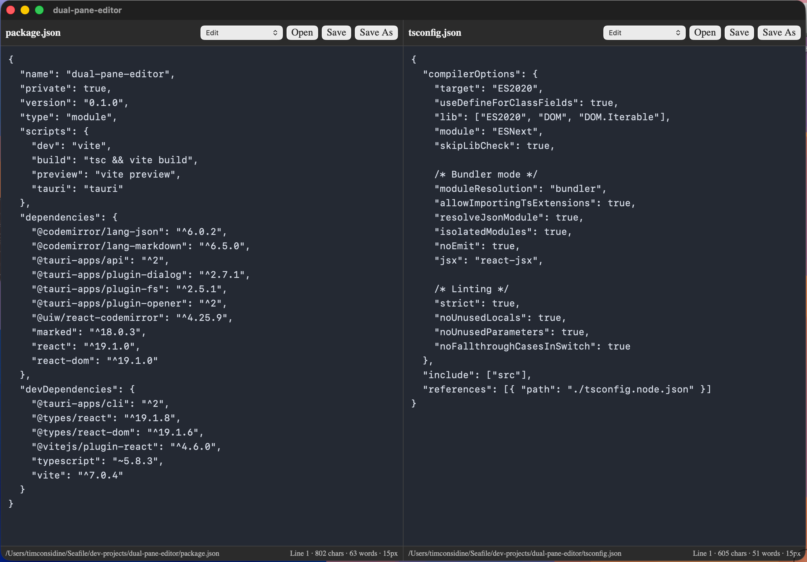

# dual-pane-editor

A lightweight dual-pane desktop text editor built with Tauri.

Designed for text-oriented workflows where two independent documents need to be viewed and edited simultaneously without IDE complexity or diff-tool semantics.

---

# Features

- Two fully independent editing panes
- Open/save/save-as per pane
- Independent scrolling and cursor position
- Dark mode UI
- Word wrap
- Markdown editing
- Markdown preview mode
- HTML preview mode
- Live document statistics
  - current line number
  - character count
  - word count
- Adjustable font size
  - Cmd/Ctrl + `+`
  - Cmd/Ctrl + `-`
- Search within current pane
  - Cmd/Ctrl + `F`
- Unsaved-change protection
- Native desktop filesystem access
- Lightweight native desktop app (non-Electron)

---

# Technology Stack

- Tauri
- React
- TypeScript
- Rust
- HTML/CSS

---

# Why This Exists

Most modern editors are either:

- IDEs/code editors (usually "fat")
- browser tabs (not user-friendly)
- diff/merge tools (over-featured)
- overly complex writing suites (impose a 'way or working')

This app was created specifically for:

- side-by-side plain text file editing
- reviewing unrelated (different folder locations) documents simultaneously
- markdown/text workflows
- lightweight desktop productivity

without requiring a full IDE.

---

# Screenshots



---

# Prerequisites

## All Platforms

Install:

- Node.js
- npm
- Rust
- Cargo

Rust installation:

https://rustup.rs/

Verify:

```bash
cargo --version
rustc --version
node --version
npm --version
```

## clone repo

```
git clone https://github.com/YOURNAME/dual-pane-editor.git
cd dual-pane-editor
```

## install dependencies

```
npm install
```

## development 

test the app with :

```
npm run tauri dev
```

This launches:

* Vite dev server
* Tauri desktop shell
* live reload

--- 

## build release / runtime

### macOS

```
npm run tauri build
```

Generated app bundle:

```
src-tauri/target/release/bundle/macos/
```

A pre-built Mac dmg is in Releases

Generated DMG: 

```
src-tauri/target/release/bundle/dmg/
```

Install by:

* dragging .app into /Applications

---

### Windows

Build on Windows:

```
npm install
npm run tauri build
```

Generated files:

```
src-tauri\target\release\bundle\
```

Usually includes:

* .msi
* .exe

Install by:

* running installer

---

### Linux

Build on Linux:

```
npm install
npm run tauri build
```

Generated packages may include:

* .deb
* .AppImage
* .rpm

depending on installed packaging tools.

Install via:

* package manager
* AppImage execution

Example:

```
chmod +x dual-pane-editor.AppImage
./dual-pane-editor.AppImage
```

---

## Cross-Platform Notes

Tauri apps are generally built natively per platform:

* build macOS app on macOS
* build Windows app on Windows
* build Linux app on Linux

Cross-compilation is possible but not the standard workflow.


## Possible Future Features

* configurable themes
* session restore
* workspaces
* PDF viewer
* split preview/edit modes
* specific close button (now just open a new file or close the app)

## Licence

- CC0 1.0 Universal
- see LICENCE


